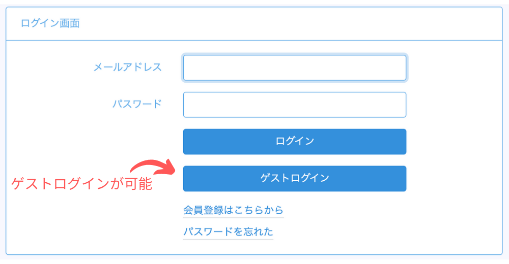
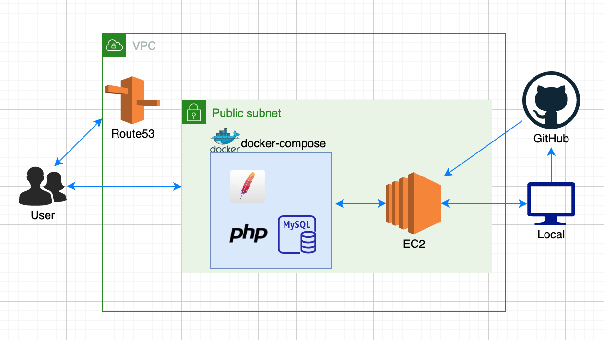
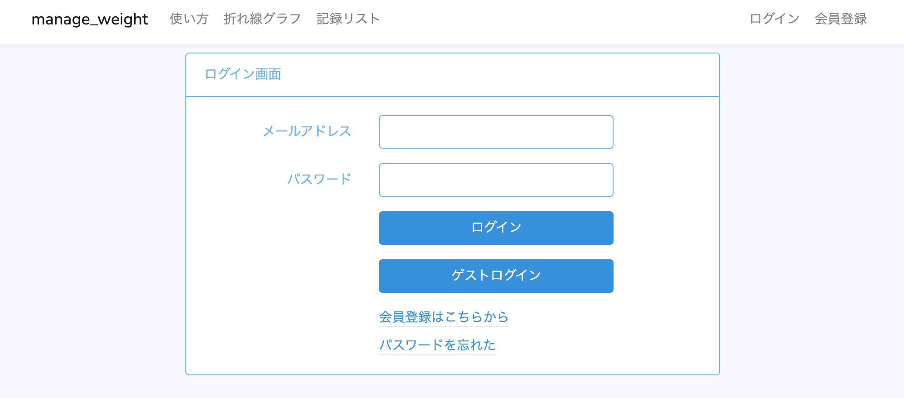
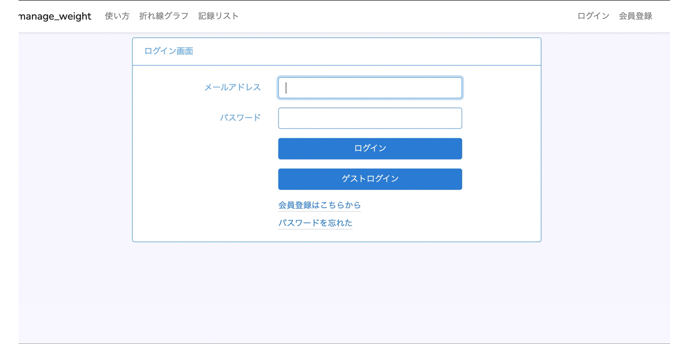

  

# 制作背景
体重や体脂肪率などを記録して折れ線グラフなどで記録を可視化することで体づくりのモチベーションをアップするアプリです。想定しているユーザーとしては、筋トレやダイエットをする習慣のある人を想定しています。スマホのメモや紙に記録するのは手間がかかるため、WEB上で記録、管理できるサービスを制作しました。解決したい課題として、「筋肉が増えている、ダイエットが成功している」事を分かりやすく実感したいという欲求の解決を目指してつくりました。

# URL
- URL: http://manage-weight.link
- ゲストログインボタンで簡単にログインできます。

  

# ER図

  

# インフラ構成図

  

# 使用技術
- php 7.2
- Laravel 6.2
- HTML
- CSS
- jQuery
- DB: MySQL
- Webサーバー: Apache

# 機能一覧
|      |  機能 |
| ---- | ---- |
|  1   |  アカウント登録機能  |
|  2  |  ログイン機能  |
|  3  |  ゲストログイン機能  |
|  4  |  パスワード再設定機能(SES)  |
|  5  |  ログアウト機能  |
|  6  |  体重記録機能(CRUD)  |
|  7  |  記録内容更新機能(CRUD)  |
|  8  |  体重記録折れ線グラフ機能(jQuery)  |
|  9  |  体重記録一覧機能  |
|  10  |  使い方機能  |

# 何ができるのか

### 1.トップページ

  

- 最初にトップページにアクセスするとログイン画面に遷移します。
- ヘッダーに会員登録、ログインを配置、ログインフォーム下にパスワード再設定を配置。 また、スマホユーザーにわかりやすいようログインフォーム下にも会員登録を配置しております。
- パスワード再設定はAWSのSESを使用しています。

### 2.ユーザー認証

  

- メールアドレスとパスワードを入力してログインします
- ログイン後、本日の体重記録がまだない場合は体重記録画面に遷移します

### 3.ユーザー登録

  

- ユーザー情報はMySQLに記録されます
- ユーザーネーム,Eメールアドレス,パスワードを入力して登録。

### 4.体重記録

### 5.記録編集

### 6.記録削除

### 7.記録折れ線グラフ

### 8.記録一覧

### 9.レスポンシブ対応

### 10.バリデーション

### 11.工夫したところ(見た目)

### 12.工夫したところ(実装)
