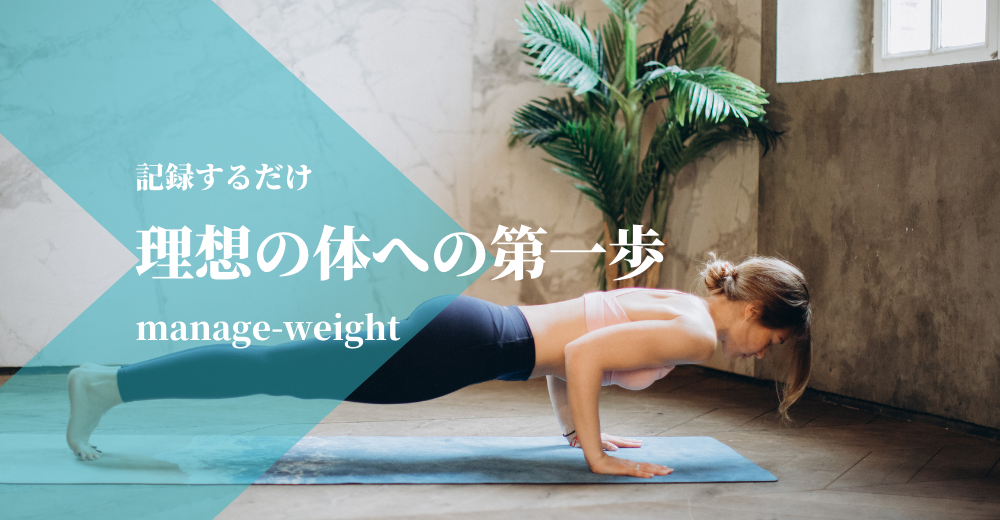

<p align="center">
  
</p>


# 制作背景
体重や体脂肪率などを記録して折れ線グラフなどで記録を可視化することで体づくりのモチベーションをアップするアプリです。想定しているユーザーとしては、筋トレやダイエットをする習慣のある人を想定しています。スマホのメモや紙に記録するのは手間がかかるため、WEB上で記録、管理できるサービスを制作しました。解決したい課題として、「筋肉が増えている、ダイエットが成功している」事を分かりやすく実感したいという欲求の解決を目指してつくりました。


# URL
- URL: http://manage-weight.link
- ゲストログインボタンで簡単にログインできます。
<p align="center">
  
</p>


# ER図
<p align="center">
  
</p>


# インフラ構成図
<p align="center">
  
</p>


# 使用技術
- php 7.2
- Laravel 6.2
- HTML
- CSS
- jQuery
- DB: MySQL
- Webサーバー: Apache
- Docker
- Route53
- SES


# 機能一覧
|      |  機能 |
| ---- | ---- |
|  1   |  アカウント登録機能  |
|  2  |  ログイン機能  |
|  3  |  ゲストログイン機能  |
|  4  |  パスワード再設定機能(SES)  |
|  5  |  ログアウト機能  |
|  6  |  体重記録機能(CRUD)  |
|  7  |  記録内容更新機能(CRUD)  |
|  8  |  体重記録折れ線グラフ機能(jQuery)  |
|  9  |  体重記録一覧機能  |
|  10  |  使い方機能  |

# 何ができるのか

### 1.トップページ

<p align="center">
  
</p>

- 最初にトップページにアクセスするとログイン画面に遷移します。
- ヘッダーに会員登録、ログインを配置、ログインフォーム下にパスワード再設定を配置。<br>また、スマホユーザーにわかりやすいようログインフォーム下にも会員登録を配置しております。
- パスワード再設定はAWSのSESを使用しています。

### 2.ユーザー認証
<p align="center">
  
</p>

- メールアドレスとパスワードを入力してログインします

### 3.ユーザー登録
<p align="center">
  
</p>

- ユーザー情報はMySQLに記録されます。
- ユーザーネーム、Eメールアドレス、パスワードを入力して登録。
### 4.体重記録
<p align="center">
  
</p>

- ログイン後、本日の記録がまだ無い場合は記録画面に遷移します。
- 前日の記録漏れがある場合は、記録追加ボタンを押すことで記録を追加することができます。
- 記録する日付が既に登録済みの場合はバリデーションエラーが表示されます。

### 5.記録編集
<p align="center">
  
</p>

- 編集ボタンで記録の編集が可能です。
- 記録の際に、データベース側で、日付の重複を回避したかったため、日付は編集できない仕様にしています。

### 6.記録削除
<p align="center">
  
</p>

- 編集画面に遷移後、削除ボタンを押すことで記録の削除が可能です。
- 削除ボタンを押した後、モーダルで確認画面を表示しています。

### 7.記録折れ線グラフ
<p align="center">
  
</p>

- メニューバーの折れ線グラフを押すことで、折れ線グラフ画面に遷移します。
- それぞれの記録毎にグラフの切り替えが可能で、期間も週間〜年間まで選択可能です。

### 8.記録一覧
<p align="center">
  
</p>

- メニューバーの記録リストを押すことで、記録リスト画面に遷移します。テーブル表示された記録を閲覧可能です。
- 期間は週間〜月間で選択可能です。
- 折れ線グラフではそれぞれの項目毎にしか閲覧できず、一気にそれぞれの記録を閲覧したいこともあるため実装しました。

### 9.レスポンシブ対応
<p align="center">
  
</p>

- Googleの検証機能を使用し、一番小さなサイズのスマホでもデザイン崩れの無いよう実装しました。

### 10.バリデーション
<p align="center">
  
</p>

<p align="center">
  
</p>

- ログイン時、メールアドレス、パスワードのどちらかが一致していない場合はバリデーションエラーを表示します
- 体重記録時、編集時はFormRequestによるバリデーションを設定しています。
- 日付の重複、体重未記入、数字以外の記入、正常な範囲外の記入の場合はバリデーションエラーを表示します。

```
class CreateWeights extends FormRequest
{
    /* *
     * Determine if the user is authorized to make this request.
     *
     * @return bool
     */
    public function authorize()
    {
        return true;
    }

    /* *
     * Get the validation rules that apply to the request.
     *
     * @return array
     */
    public function rules()
    {
        return [
            'date' => ['required','date','before_or_equal:today',Rule::unique('weights')->where(function ($query) {
                    $user  = Auth::user();
                    return $query->where('user_id', $user->id);
                }),
        ],
            'weight' => 'required|numeric|max:300',
            'fat_percentage' => 'numeric|nullable|max:100',
            'muscle_weight' => 'numeric|nullable|max:100',
            'calorie_intake' => 'integer|nullable|max:4000',
        ];
    }

    public function attributes()
    {
        return [
            'date' => '日付',
            'weight' => '体重',
            'fat_percentage' => '体脂肪率',
            'muscle_weight' => '筋肉量',
            'calorie_intake' => '摂取カロリー'
        ];
    }
}
```

### 11.工夫したところ(見た目)


### 12.工夫したところ(実装)
